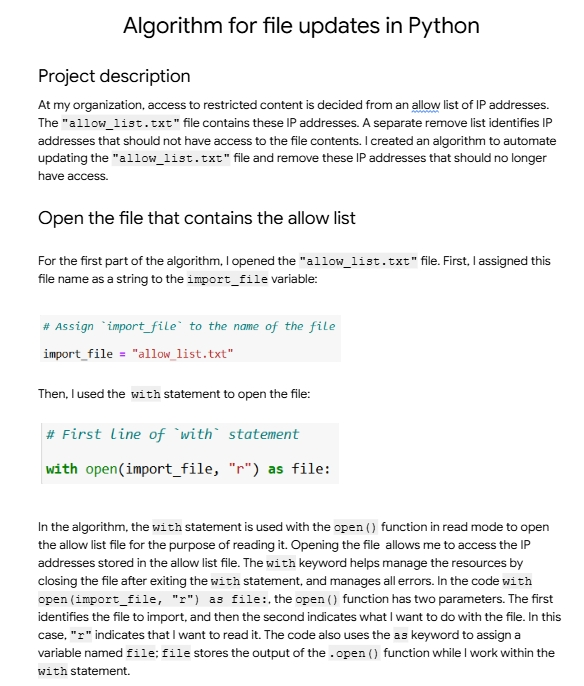
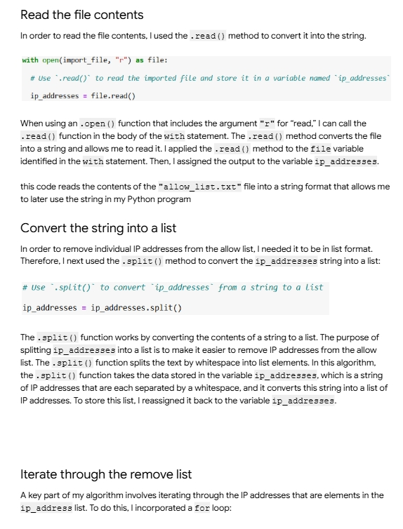
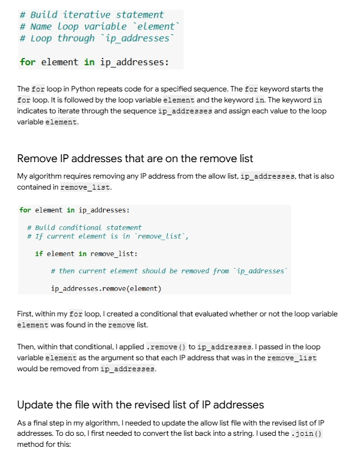
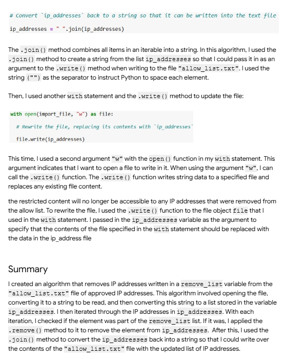

# 🐍 Python Security Automation — Allow List Management

A Python algorithm that automates the management of an IP address allow list by removing unauthorized addresses. Completed as part of the Google Cybersecurity Professional Certificate.

## 📖 Project Overview

Developed a **Python script** to automate access control management for a security-restricted resource. The organization maintains an `allow_list.txt` file of authorized IP addresses and a separate `remove_list` of IP addresses that should no longer have access. This algorithm automatically updates the allow list by removing all IP addresses that are found in the remove list.

## 🎯 Scenario

At my organization, access to restricted content is controlled by an **allow list of IP addresses** stored in `allow_list.txt`. When IPs need to be removed (e.g., decommissioned devices, terminated employees, revoked partners), the process was manual and error-prone. This algorithm **automates the update process** to ensure security is maintained efficiently and accurately.

## 🛠️ Tools & Skills Used

- **Python 3** — scripting language
- **File I/O operations** — reading and writing files
- **`with` statement** — safe file handling with automatic cleanup
- **String manipulation** — `.split()` and `.join()` methods
- **Lists** — data structure for managing IP addresses
- **`for` loops** — iterating through data
- **Conditional statements** — `if` logic for decision-making
- **`.remove()` method** — deleting list elements
- **Security automation** — reducing manual access management work

## 🔍 Algorithm Breakdown

### 📂 Step 1: Open the Allow List File

Opened the `allow_list.txt` file for reading using a `with` statement for safe resource management.

```python
# Assign import_file to the name of the file
import_file = "allow_list.txt"

# First line of with statement
with open(import_file, "r") as file:
```

**Explanation:** The `with` statement automatically closes the file after use and handles errors gracefully. The `"r"` argument opens the file in read mode.



---

### 📖 Step 2: Read the File Contents

Read the file contents into a string variable using the `.read()` method.

```python
# Use .read() to read the imported file and store it in a variable named ip_addresses
ip_addresses = file.read()
```

**Explanation:** The `.read()` method converts the file contents into a single string stored in the `ip_addresses` variable, allowing it to be manipulated later in the program.

---

### 🔄 Step 3: Convert String to List

Converted the IP addresses string into a list using the `.split()` method for easier manipulation.

```python
# Use .split() to convert ip_addresses from a string to a list
ip_addresses = ip_addresses.split()
```

**Explanation:** The `.split()` method splits the string by whitespace into individual list elements. This makes it easy to loop through and check each IP address individually.



---

### 🔁 Step 4: Iterate Through the List

Built a `for` loop to iterate through each IP address in the list.

```python
# Build iterative statement
# Name loop variable `element`
# Loop through `ip_addresses`
for element in ip_addresses:
```

**Explanation:** The `for` loop assigns each IP address from `ip_addresses` to the loop variable `element`, one at a time.

---

### 🚫 Step 5: Remove Unauthorized IPs

Used a conditional statement inside the loop to check if each IP was in the remove list, and removed it if so.

```python
for element in ip_addresses:
    # Build conditional statement
    # If current element is in `remove_list`,
    if element in remove_list:
        # then current element should be removed from `ip_addresses`
        ip_addresses.remove(element)
```

**Explanation:** For every IP address in the allow list, the algorithm checks whether it also appears in the `remove_list`. If it does, `.remove()` deletes that IP from `ip_addresses`.



---

### 💾 Step 6: Update the Allow List File

Converted the updated list back to a string and wrote it back to the file.

```python
# Convert ip_addresses back to a string so that it can be written into the text file
ip_addresses = " ".join(ip_addresses)

with open(import_file, "w") as file:
    # Rewrite the file, replacing its contents with ip_addresses
    file.write(ip_addresses)
```

**Explanation:**
- `.join()` converts the list back into a single string with spaces between IPs
- The file is reopened in write mode (`"w"`) to overwrite its contents
- `.write()` saves the updated list of authorized IPs back to `allow_list.txt`



---

## 📊 Summary of Algorithm

The complete workflow:

1. 📂 **Open** the allow list file
2. 📖 **Read** its contents into a string
3. 🔄 **Convert** the string into a list
4. 🔁 **Iterate** through each IP address
5. ✅ **Check** if each IP is in the remove list
6. 🚫 **Remove** any matching IPs
7. 🔄 **Convert** the list back to a string
8. 💾 **Write** the updated string back to the file

**Result:** The `allow_list.txt` file is automatically updated — unauthorized IP addresses no longer have access to restricted content.

## 💡 Key Concepts Applied

- **File I/O** — reading from and writing to files in Python
- **`with` statement** — Pythonic way to handle files safely
- **String vs List** — understanding when to use each data type
- **Iteration** — processing collections one element at a time
- **Conditional Logic** — making decisions based on data
- **List Manipulation** — adding, removing, and modifying elements
- **Access Control Automation** — using scripts to enforce security policies

## 🎓 Lessons Learned

- **Automation reduces human error** — manual list management leads to mistakes
- **The `with` statement is best practice** — it handles file closure and errors automatically
- **String-to-list conversion is common** — real data often needs restructuring to work with
- **Loops + conditionals are the foundation** of most security scripts
- **Python is a powerful security tool** — even simple scripts can enforce important policies

## 🛡️ Real-World Applications

This type of automation is used constantly in SOC and IT security work:

- 🔐 **Firewall allow lists** — automatically updating permitted IPs
- 👤 **User access management** — bulk removing terminated employees
- 🎯 **Threat intelligence** — auto-adding malicious IPs to block lists
- 📊 **Log filtering** — cleaning data for analysis
- ⚙️ **SOAR playbooks** — Python-driven automation in Security Orchestration platforms
- 🚨 **Incident response** — automated remediation scripts

## 📚 Certificate Context

This project was completed as part of the **Google Cybersecurity Professional Certificate** on Coursera, demonstrating practical application of Python programming for security automation in a simulated enterprise environment.

## 👤 Author

**Yorgo Albitar**
Cybersecurity Student | Aspiring SOC Analyst
📧 Email: Yorgobitar59@gmail.com
🔗 GitHub: https://github.com/Yorgo-Albitar
